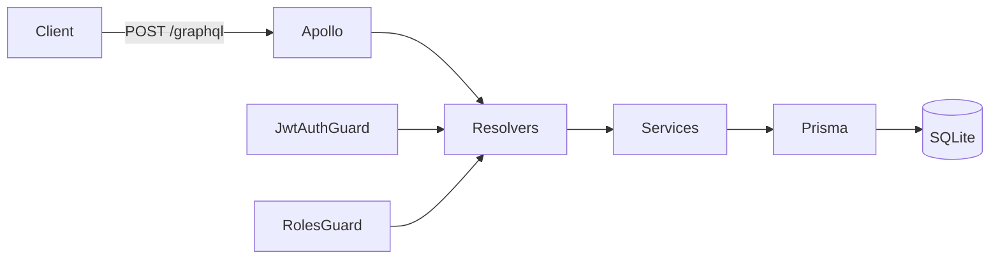

# Architecture — Slooze food ordering backend

## Overview

The service exposes a single **GraphQL** HTTP endpoint. Clients authenticate with **JWT** bearer tokens issued by the `login` mutation. Authorization combines **role-based** rules (RBAC) with **country-based** data scope (relational / attribute access for Managers and Members).

## Layers

| Layer | Responsibility |
|-------|----------------|
| **Resolvers** | GraphQL operations, DTO validation (class-validator), attach guards |
| **Services** | Business rules, filtering by role/country, persistence via Prisma |
| **Prisma** | Schema, migrations, seed |
| **Guards** | `JwtAuthGuard` (global, skippable with `@Public()`), `RolesGuard` (with `@Roles()`) |

## Modules

- **`PrismaModule`** — global `PrismaService`.
- **`AuthModule`** — `login`, `JwtStrategy`, `JwtModule` signing.
- **`UsersModule`** — `me` query.
- **`RestaurantsModule`** — `restaurants`, `restaurant(id)`; lists scoped by country for non-Admins.
- **`OrdersModule`** — cart (`activeCart`, `addToCart`, `setCartLineQuantity`), `myOrders`, `checkout`, `cancelOrder`. One open **CART** per user; switching restaurant replaces the cart. Checkout/cancel restricted to Admin/Manager; country rules apply via `assertCountryAccess`.
- **`PaymentsModule`** — `paymentMethods(userId)` with read scope; payment **mutations** Admin-only.

## RBAC matrix (enforcement)

- **Checkout / cancel:** `@Roles(ADMIN, MANAGER)` + service checks; Members rejected.
- **Payment CRUD:** `@Roles(ADMIN)` only.
- **Everything else:** any authenticated user, subject to country rules in services.

## Country scope (Re-BAC)

- **`User.country`:** `INDIA` | `AMERICA` for Managers/Members; `null` for Admin (global).
- **`assertCountryAccess(user, resourceCountry)`:** no-op for Admin; Managers/Members must match `resourceCountry`.
- **Restaurants / menu:** filtered in `RestaurantsService` for non-Admins.
- **Orders:** `Order.country` denormalized from the restaurant for consistent checks.
- **Payment methods:** tagged with `country`; must align with the customer and order when checking out.

## Security notes

- Passwords hashed with **bcrypt** in seed and compared in `AuthService`.
- JWT payload refreshed from the database on each request in `JwtStrategy.validate` so role/country changes take effect without relying only on stale token claims.
- Production: use a strong `JWT_SECRET`, HTTPS, and a managed database instead of SQLite if required.
